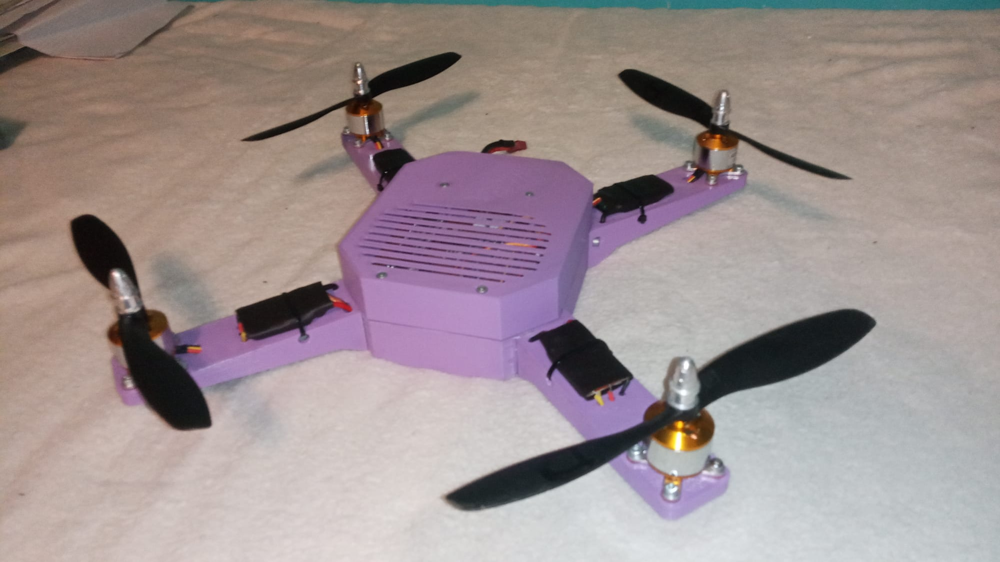
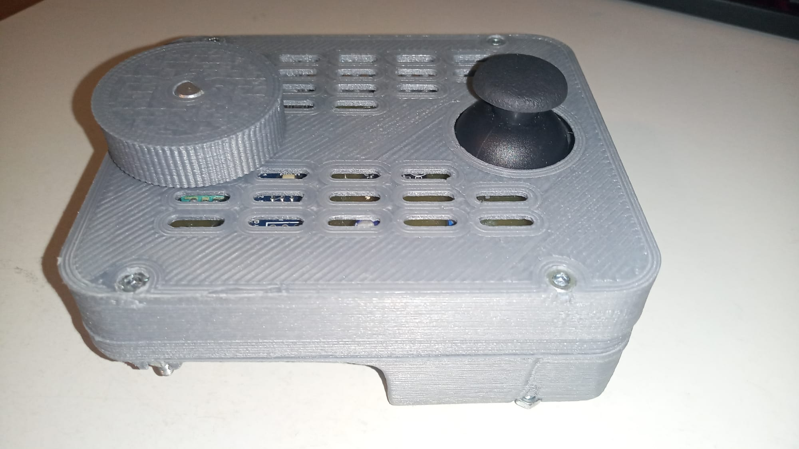

# Custom Quadcopter & Wireless Controller (From Scratch)

## Overview
This repository serves as a showcase of a fully custom quadcopter drone and its wireless remote controller, built entirely from scratch during my high school studies. 

The project was highly successful and placed in the **Top 10 in the National Round of the SOČ** (Students' Professional Activities) competition in the Czech Republic in the Electrical Engineering category (2023).

## Project Gallery

*Fully assembled quadcopter with custom 3D printed frame and flight controller.*

*Custom-built wireless remote controller.*

> **🎥 Watch the flight test video on YouTube:** [Link to your video]

## System Architecture

Instead of using off-the-shelf flight controllers, I designed and implemented the entire system architecture myself. This required cross-disciplinary integration of mechanical design, hardware engineering, and embedded software.

### Hardware (KiCad)
* **Flight Controller Board:** Custom PCB design including the main microcontroller, IMU sensors, power management and motor driver outputs.
* **Remote Controller Board:** Custom PCB for the handheld transmitter, including joystick inputs and a wireless transceiver module.
* Both boards were designed from schematic to final routing using KiCad.

### Software (C / Arduino IDE)
* **Flight Dynamics:** Implemented a custom PID controller for multi-axis stabilization.
* **Sensor Fusion:** Processed raw IMU data to estimate the drone's orientation.
* **Wireless Communication:** Reliable data packet transmission between the remote and the drone.

### Mechanical Design (FreeCAD)
* The drone's frame and the remote controller's enclosure were modeled in 3D using FreeCAD.
* Parts were optimized for weight and manufactured using 3D printing.

## Why a "Showcase" Repository?
Since this was one of my earliest complex projects, the original source code and PCB routing reflect my high school skill level and are not actively maintained. However, the system as a whole successfully demonstrates my foundational understanding of embedded systems, control theory, and hardware design.
